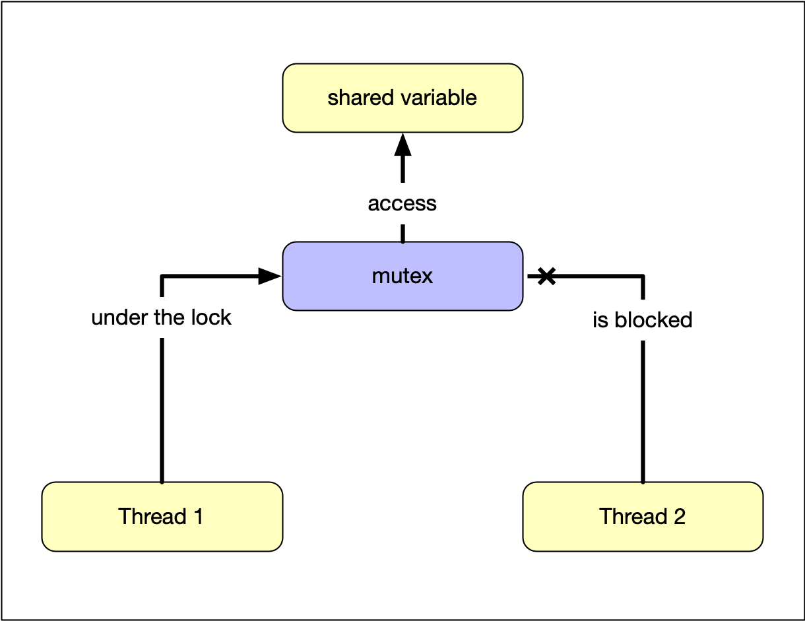

# Using a Mutex To Protect Shared Data

## The mutex entity

Until now, the methods we have used to pass data between threads were short-term and involved passing an argument (the promise) from a parent thread to a worker thread and then passing a result back to the parent thread (via the future) once it has become available. The promise-future construct is a non-permanent communication channel for one-time usage.

We have seen that in order to avoid data races, we need to either forego accessing shared data or use it in read-only access without mutating the data. In this chapter, we want to look at a way to establish a stable long-term communication channel that allows for both sharing and mutation. Ideally, we would like to have a communication protocol that corresponds to voice communication over a radio channel, where the transmitter uses the expression "over" to indicate the end of the transmission to the receiver. By using such a protocol, sender and receiver can take turns in transmitting their data. In C++, this concept of taking turns can be constructed by an entity called a "mutex" - which stands for MUtual EXclusion.

Recall that a data race requires simultaneous access from two threads. If we can guarantee that only a single thread at a time can access a particular memory location, data races would not occur. In order for this to work, we would need to establish a communication protocol. It is important to note that a mutex is not the solution to the data race problem per se but merely an enabler for a thread-safe communication protocol that has to be implemented and adhered to by the programmer.

</img>

Let us take a look at how this protocol works: Assuming we have a piece of memory (e.g. a shared variable) that we want to protect from simultaneous access, we can assign a mutex to be the guardian of this particular memory. It is important to understand that a mutex is bound to the memory it protects. A thread 1 who wants to access the protected memory must "lock" the mutex first. After thread 1 is "under the lock", a thread 2 is blocked from access to the shared variable, it can not acquire the lock on the mutex and is temporarily suspended by the system.

Once the reading or writing operation of thread 1 is complete, it must "unlock" the mutex so that thread 2 can access the memory location. Often, the code which is executed "under the lock" is referred to as a "critical section". It is important to note that also read-only access to the shared memory has to lock the mutex to prevent a data race - which would happen when another thread, who might be under the lock at that time, were to modify the data.

When several threads were to try to acquire and lock the mutex, only one of them would be successful. All other threads would automatically be put on hold - just as cars waiting at an intersection for a green light (see the final project of this course). Once the thread who has succeeded in acquiring the lock had finished its job and unlocked the mutex, a queued thread waiting for access would be woken up and allowed to lock the mutex to proceed with his read / write operation. If all threads were to follow this protocol, a data race would effectively be avoided. Before we take a closer look at such a protocol, let us analyze a code example next.C4-2-A2.png"></img>

Let us take a look at how this protocol works: Assuming we have a piece of memory (e.g. a shared variable) that we want to protect from simultaneous access, we can assign a mutex to be the guardian of this particular memory. It is important to understand that a mutex is bound to the memory it protects. A thread 1 who wants to access the protected memory must "lock" the mutex first. After thread 1 is "under the lock", a thread 2 is blocked from access to the shared variable, it can not acquire the lock on the mutex and is temporarily suspended by the system.

Once the reading or writing operation of thread 1 is complete, it must "unlock" the mutex so that thread 2 can access the memory location. Often, the code which is executed "under the lock" is referred to as a "critical section". It is important to note that also read-only access to the shared memory has to lock the mutex to prevent a data race - which would happen when another thread, who might be under the lock at that time, were to modify the data.

When several threads were to try to acquire and lock the mutex, only one of them would be successful. All other threads would automatically be put on hold - just as cars waiting at an intersection for a green light (see the final project of this course). Once the thread who has succeeded in acquiring the lock had finished its job and unlocked the mutex, a queued thread waiting for access would be woken up and allowed to lock the mutex to proceed with his read / write operation. If all threads were to follow this protocol, a data race would effectively be avoided. Before we take a closer look at such a protocol, let us analyze a code example next.

## Using timed_mutex

In the following, a short overview of the different available mutex types is given:

*   `mutex`: provides the core functions lock() and unlock() and the non-blocking try_lock() method that returns if the mutex is not available.
*   `recursive_mutex`: allows multiple acquisitions of the mutex from the same thread.
*   `timed_mutex`: similar to mutex, but it comes with two more methods try_lock_for() and try_lock_until() that try to acquire the mutex for a period of time or until a moment in time is reached.
*   `recursive_timed_mutex`: is a combination of timed_mutex and recursive_mutex.

# Using Locks to Avoid Deadlocks

## Lock Guard

In the previous example, we have directly called the `lock()` and `unlock()` functions of a mutex. The idea of "working under the lock" is to block unwanted access by other threads to the same resource. Only the thread which acquired the lock can unlock the mutex and give all remaining threads the chance to acquire the lock. In practice however, direct calls to `lock()` should be avoided at all cost! Imagine that while working under the lock, a thread would throw an exception and exit the critical section without calling the unlock function on the mutex. In such a situation, the program would most likely freeze as no other thread could acquire the mutex any more. This is exactly what we have seen in the function `divideByNumber` from the previous example.

We can avoid this problem by creating a `std::lock_guard` object, which keeps an associated mutex locked during the entire object life time. The lock is acquired on construction and released automatically on destruction. This makes it impossible to forget unlocking a critical section. Also, `std::lock_guard` guarantees exception safety because any critical section is automatically unlocked when an exception is thrown.

## Unique Lock

The problem with the previous example is that we can only lock the mutex once and the only way to control lock and unlock is by invalidating the scope of the std::lock_guard object. But what if we wanted (or needed) a finer control of the locking mechanism?

A more flexible alternative to std::lock_guard is _unique_lock_, that also provides support for more advanced mechanisms, such as deferred locking, time locking, recursive locking, transfer of lock ownership and use of condition variables (which we will discuss later). It behaves similar to lock_guard but provides much more flexibility, especially with regard to the timing behavior of the locking mechanism.

The main advantages of using `std::unique_lock<>` over `std::lock_guard` are briefly summarized in the following. Using `std::unique_lock` allows you to…

1.  …construct an instance without an associated mutex using the default constructor
2.  …construct an instance with an associated mutex while leaving the mutex unlocked at first using the deferred-locking constructor
3.  …construct an instance that tries to lock a mutex, but leaves it unlocked if the lock failed using the try-lock constructor
4.  …construct an instance that tries to acquire a lock for either a specified time period or until a specified point in time

Despite the advantages of `std::unique_lock<>` and `std::lock_guard` over accessing the mutex directly, however, the deadlock situation where two mutexes are accessed simultaneously (see the last section) will still occur.
